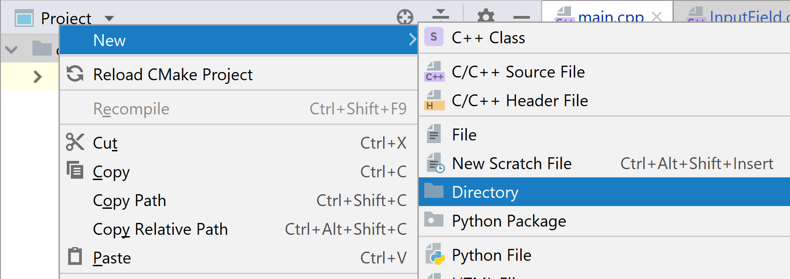

# {{ page.title }}
{: .no_toc}

- TOC
{:toc}

## Today

There's no supporting Jupyter Notebook today, instead we will be applying the techniques covered since we started looking at object-orientation to the Monte Carlo code we looked at in week 7 of term 1.

We will be doing two things:

1. We will use CMake to split out the file-reading code we have been creating recently into its own library.
2. Create a new object-orientated library for the Monte Carlo methods we saw before (based on code from week 7)

In most places there are example solutions that you need to click on to show - please try and solve the problem yourself before looking at the answers, you will learn more from doing it yourself than just reading the solution.

## Turning our file reading code into a library

Firstly we need the code we have been developing over the last few weeks.  Hopefully you have your own, if not get a copy from https://github.com/loz-hurst/cpp-finance-materials-new-code

### Move the code for the library into the same directory

Within CLion, right-click on the project browser to create a new directory:



Call the directory something sensible, although the actual name is not important for the code.  I chose 'InputReader'.

Move the files related to the InputReader code into that directory.  From the model solutions, these files are:

* CSVInputReader.cpp
* CSVInputReader.hpp
* FixedWidthInputReader.hpp
* InputField.cpp
* InputField.hpp
* InputReader.cpp
* InputReader.hpp
* TSVInputReader.cpp
* TSVInputReader.hpp

### Build the code as a self-contained library

We need to add a CMakeLists.txt file to our new directory, which will tell the compiler how to build it as a self-contained library.

In this new CMakeLists.txt, start by adding the name of the library and two lines to specify the version of CMake and C++ standard the library code uses:

```cmake
cmake_minimum_required(VERSION 3.12)
set(CMAKE_CXX_STANDARD 14)
```

Next we need to add the configuration to build the code as a library.  Previously we used 'add_executable' to build the program, in order to build as a library we need to use 'add_library' instead with all the files that are part of the library:

```cmake
add_library(InputReader STATIC
    CSVInputReader.cpp
    CSVInputReader.hpp
    FixedWidthInputReader.hpp
    InputField.cpp
    InputField.hpp
    InputReader.cpp
    InputReader.hpp
    TSVInputReader.cpp
    TSVInputReader.hpp
)
```

'InputReader' is a name for the library in our CMake environment.  'STATIC' says to build a staticly, rather than dynamically, linked library.  This means the library gets built into the final program, rather than found and loaded at runtime.
{: .callout .technical}

Finally, we need to tell CMake to look in this folder for headers in projects that use the library.  To do this, we use the 'target_include_directories' CMake command:

```cmake
target_include_directories(InputReader
    PUBLIC ${CMAKE_CURRENT_LIST_DIR}
)
```

The PUBLIC here means "anything that links to InputReader needs to have this include directory added".  If we were adding an include directory that only InputReader needed internally we would use PRIVATE instead.
{: .callout .terminology}

### Update our main CMake configuration to use the library

Finally, we now update the project's main CMakeLists.txt file to use this library.  To do this, we need to tell CMake to use the library's CMakeLists.txt by putting the 'add_subdirectory' command into it (remember to use the actual name of the directory you put the InputReader code in):

```cmake
add_subdirectory(InputReader)
```

Next, remove any reference to the input reader code in the 'add_executable' instruction - our executable should just be the main.cpp file (plus the libraries it uses):

```cmake
add_executable(MyProject main.cpp)
```

The last step is to tell CMake it needs to link the project to the library.  The project and the library names need to match what you have as the names in 'add_executable' and 'add_library':

```cmake
target_link_libraries(MyProject PRIVATE InputReader)
```

The 'PRIVATE' here says "MyProject needs to be linked to InputReader, but anything that links to MyProject (once it's built) does not need to separately link to InputReader".
{: .callout .terminology}

## OO Monte Carlo

This is going to be based on the code for week 7's exercises, which is available on-line at https://github.com/loz-hurst/cpp-finance-week7-code (this includes the exercise solutions, we're just going to work on the original version).

### Create a Monte Carlo library

Firstly, create a new directory and CMakeLists file for a new Monte Carlo library.  Use the CMakeLists.txt from the input reader we just wrote as a template, remembering to change all the names from InputReader to something appropriate (e.g. MonteCarlo) and remove the InputReader source files from the MonteCarlo CMakeLists.txt.

Add the subdirectory to the main CMakeLists.txt (again, use what we just did for InputReader as a template) and update the list of libraries that your project needs to be linked to, so that it includes the new one:

```cmake
target_link_libraries(MyProject PRIVATE InputReader MonteCarlo)
```

At the moment CMake will be complaining that there are no files to build MonteCarlo - let's add a base class for our MonteCarlo methods.  Don't put anything in it for now:

```cpp
class MonteCarlo {

};
```

You do need to create a header and code (.cpp) file for the class, or CMake will become confused since there's no code to build so it cannot figure out what programming language the project is using.
{: .callout .beware}

### Start with a skeleton base class

The Monte Carlo[MC] codes we looked at in week 7 have a number of things in common:

* A sample step, which computes a single random value
* A loop that repeats the sample step many times, to produce the estimate for the solution
* They all use a set of Black-Scholes initial data values
* They all have an accumulator used to calculate the result and a separate one for the error
* They all need to know how many samples have been taken to calculate the result and error
* They each return a result that consists of:
  * The estimate
  * Some value for the error in the estimate

These may be common to all MC methods, or not.  For our code we do not care - if they are common to all the versions we have written then they should be in the base class.  To try and provide more nuance abstractions would not benefit our program but make it more complex, which is bad for maintainability (and likely for performance too).
{: .callout .hint}

There are a number of different ways to approach this and structure both the object hierarchy and the code.  I'm going to show you one way.
{: .callout .philosophy}

Firstly we know we will need the initial data values, so create a struct for that - it makes sense to put this in its own header:

```cpp
struct BSData {
    double s_0; // underlying price at t=0
    double rate; // risk-free rate
    double sigma; // Volatility
    double maturity; // Time to maturity (T)
    double strike; // Strike price
};
```

Next, we should add the common data members, methods and a constructor to the MonteCarlo base class.  Data members should be protected (private to within this class and descendent) and their names end with an underscore, the constructor should just take a BSData struct and store it in a data member and our methods, which we identified above, should all be virtual and abstract (as their implementations will vary in each specialised sub-class).

Using the list of common features above as a guide, create the base class's declaration in a header (hpp) file and definition of the non-abstract functions in a code (cpp) file.

<details>
    <summary>Example solution</summary>

```cpp
// Base class for Monte-Carlo[MC] methods
class MonteCarlo {
protected:
    const BSData bs_data_; // Black-Scholes data for the method
    double accumulator_; // Accumulator for the result
    double error_accumulator_; // Accumulator for the error
    unsigned int samples_; // How many samples have been computed
public:
    // Constructor - takes a completed BSData structure for the MC methods
    MonteCarlo(const BSData& data );
    // Calculates one sample and stores it internally
    virtual void runSample() = 0;
    // Calculates n samples and stores the results internally
    virtual void runSamples(const unsigned long n);
    // Returns the result
    virtual double getResult() = 0;
    // Returns the error value
    virtual double getError() = 0;
    // Resets the internal state for starting a fresh set of samples
    virtual void reset();
};
```

```cpp
MonteCarlo::MonteCarlo(const BSData& data)
: bs_data_{data}, accumulator_{0}, error_accumulator_{0}, samples_{0}
{}

void MonteCarlo::runSamples(const unsigned long n) {
    for (unsigned long i {0}; n > i; ++i) {
        runSample();
    }
}

void MonteCarlo::reset() {
    accumulator_ = 0;
    error_accumulator_ = 0;
    samples_ = 0;
}
```
</details>

### The Plain MC class

Now we have a skeleton for our base MC class, we can implement the first concrete class, the plain MC method (MonteCarlo::Plain in the week 7 code).  This method calculates the size of each step, drift, sigma x sqrt(step_size) and discount to use several times during the path run - so we will want to do this in the constructor so it happens once.  The constructor for this class will also need to take the number of steps to calculate for each path and the BSData (which it will pass to the super-class's constructor).

<details>
    <summary>Example solution</summary>

```cpp
// Plain MC method
class MCPlain : public MonteCarlo {
private:
    const unsigned int steps_; // How many steps will this method simulate
    const double delta_t_; // Size of each step
    // (mu-0.5*sigma^2)delta_t - remembering mu == rate under risk neutrality
    const double drift_;
    // This is needed for each step, but will be a constant value so calculate once
    const double sigma_sqrt_delta_t_;
    const double discount_; // Discount: e^(-rT)
public:
    // Constructor - takes number of steps for the path and the underlying data
    MCPlain(const unsigned int steps, const BSData& data);
    void runSample() override;
    double getResult() override;
    double getError() override;

};
```

Each path is one sample, so that is the logic that needs to go into runSample:

```cpp
MCPlain::MCPlain(const unsigned int steps, const BSData& data)
    : MonteCarlo(data),
      steps_{steps},
      delta_t_ {data.maturity/steps},
      drift_ {(data.rate-0.5*data.sigma*data.sigma)*delta_t_},
      sigma_sqrt_delta_t_ {data.sigma*std::sqrt(delta_t_)},
      discount_ {std::exp(-data.rate * data.maturity)}
{}

void MCPlain::runSample() {
    // Start each path from S_0
    double S {bs_data_.s_0};

    // Simulate all of the steps for this path
    for (unsigned int i {0}; steps_ > i; ++i) {
        // Get a Brownian motion value
        double w {Random::GetNormalValue()};
        // S_(t+delta_t) = S_t*exp(drift + sigma_sqrt_delta_t*w)
        S = S * std::exp(drift_ + sigma_sqrt_delta_t_ * w);
    }
    
    // Calculate the final payoff for this path
    const double payoff {std::max(S-bs_data_.strike, 0.0)};

    accumulator_ += payoff;
    error_accumulator_ += payoff*payoff; // Accumulate the squares to calculate the error
    ++samples_;
}
```
</details>


Note that this code will require one of the Random utility from the week 7 code.  We can add that utility name-space to our MonteCarlo library as it is:

```cpp
namespace Random {
    // Returns a random value uniformly distributed in the interval [0, 1)
    double GetRandom();
    // Returns a random value drawn from the standard normal distribution.
    double GetNormalValue();
}
```

```cpp
#include <chrono>
#include <random>
#include "Random.hpp"


// Anonymous namespace - initialise the random number generator as early as possible
namespace {
    std::mt19937 engine ((unsigned int)std::chrono::system_clock::now().time_since_epoch().count());
    //std::default_random_engine engine;
    std::normal_distribution<double> standard_normal_distribution(0, 1);
    std::uniform_real_distribution<double> uniform_0_1(0, 1);
}

namespace Random {
    double GetRandom() {
        return ::uniform_0_1(::engine);
    }

    double GetNormalValue() {
        return ::standard_normal_distribution(::engine);
    }
}
```

Finally, we just need to add the implementations of getResult and getError for this method.

<details>
    <summary>Example solution</summary>

```cpp
double MCPlain::getResult() {
    return discount_*accumulator_/samples_;
}

double MCPlain::getError() {
    const double result = getResult();
    return discount_*std::sqrt(error_accumulator_/samples_ - result*result)/samples_;
}
```
</details>

### The Ln_S MC class

Now we have done the plain MC class, let's have a look at the Ln_S version (which defers calculating the exponent until the end).

#### Intermediate class

At this point we see that much of the initial data values are the same (as they are for the control variate version), and the final calculation for the result and error.  Rather than duplicate the code (again), we should create an intermediate class for these path simulations.

The new class will be abstract (by not implementing runSample) but the common data members and initialisation can be moved up to it, along with the result and error methods.  This new class will inherit from MonteCarlo and MCPlain & Ln_S classes from this new class (creating a hierarchy where MonteCarlo &rarr; new intermediate class &rarr; (MCPlain, Ln_S)).

<details>
    <summary>Example solution</summary>

```cpp
class PathMC : public MonteCarlo {
protected:
    const unsigned int steps_; // How many steps will this method simulate
    const double delta_t_; // Size of each step
    // (mu-0.5*sigma^2)delta_t - remembering mu == rate under risk neutrality
    const double drift_;
    // This is needed for each step, but will be a constant value so calculate once
    const double sigma_sqrt_delta_t_;
    const double discount_; // Discount: e^(-rT)
public:
    // Constructor - takes number of steps for the path and the underlying data
    PathMC(const unsigned int steps, const BSData& data);
    virtual double getResult() override;
    virtual double getError() override;
};
```

```cpp
PathMC::PathMC(const unsigned int steps, const BSData& data)
    : MonteCarlo(data),
      steps_{steps},
      delta_t_ {data.maturity/steps},
      drift_ {(data.rate-0.5*data.sigma*data.sigma)*delta_t_},
      sigma_sqrt_delta_t_ {data.sigma*std::sqrt(delta_t_)},
      discount_ {std::exp(-data.rate * data.maturity)}
{}

double PathMC::getResult() {
    return discount_*accumulator_/samples_;
}

double PathMC::getError() {
    const double result = getResult();
    return discount_*std::sqrt(error_accumulator_/samples_ - result*result)/samples_;
}
```
</details>

Now change the Plain to inherit from PathMC and delegate construction to its constructor.  The data members and getResult/getError members in Plain should be deleted (they are in the intermediate base class now).

#### The Ln_S class

The Ln_S class needs an additional data member, the ln(S_0), as that will be used for each sample.  Apart from that, we just need the new runSample method.

<details>
    <summary>Example solution</summary>

```cpp
class Ln_S : public PathMC {
private:
    const double ln_s_0_;
public:
    // Constructor - delegates to PathMC
    Ln_S(const unsigned int steps, const BSData& data);
    void runSample() override;
};
```

```cpp
Ln_S::Ln_S (const unsigned int steps, const BSData& data)
    : PathMC(steps, data), ln_s_0_ {std::log(data.s_0)}
{}

void Ln_S::runSample() {
    double ln_s {ln_s_0_};

    // Simulate all of the steps for this path
    for (unsigned int i {0}; steps_ > i; ++i) {
        // Get a Brownian motion value
        double w {Random::GetNormalValue()};
        // Calculating ln_s, so addition instead of multiplication and no exp to find at each step
        ln_s += drift_ + sigma_sqrt_delta_t_ * w;
    }
    
    /*
     * Calculate the final payoff for this path - Convert ln_s to S
     * using only one call to std::exp per path.
     */
    const double payoff {std::max(std::exp(ln_s)-bs_data_.strike, 0.0)};

    accumulator_ += payoff;
    error_accumulator_ += payoff*payoff; // Accumulate the squares to calculate the error
    ++samples_;
}
```
</details>

### The control variate class

The final path based class is the control variate version.  This version requires that we keep the values for all of the samples and differ the final accumulator calculation until just before the result is calculated, so we will need to override getResult to do that before calling the underlying version.

<details>
    <summary>Example solution</summary>

```cpp
class CV : public PathMC {
private:
    const double discount_s_0_; // Expected future stock price
    std::vector<double> payoffs_; // All calculated payoffs
    std::vector<double> cvs_; // All calculated control varaiates
    double accumulator_cv_values_; // control variate sum
    double accumulator_cv_squares_; // Squares of CV values
    double accumulator_p_cv_; // Sum of product of payoff and CV
    double accumulator_p_values_; // Sum of payoff values
    double accumulator_p_squares_; // Sum of square of payoff values
    double beta() const; // Calculates the beta (cov(c,d)/var(d))
public:
    CV(const unsigned int steps, const BSData& data);
    void runSample() override;
    double getResult() override; // N.B. not const in this version
    void reset() override;
    // Returns the correlation between the covariate and payoffs
    double getCorrelation() const;
};
```

```cpp
CV::CV(const unsigned int steps, const BSData& data)
    : PathMC(steps, data),
      discount_s_0_ {std::exp(data.rate*data.maturity)*data.s_0},
      accumulator_p_values_ {0},
      accumulator_p_squares_ {0},
      accumulator_cv_values_ {0},
      accumulator_cv_squares_ {0},
      accumulator_p_cv_ {0}
{}

void CV::runSample() {
    double S {bs_data_.s_0};

    for (unsigned int i {0}; steps_ > i; ++i) {
        double w {Random::GetNormalValue()};
        S = S * std::exp(drift_ + sigma_sqrt_delta_t_ * w);
    }

    // Store the payoff, covariate and populate accumulators
    double payoff {std::max(S - bs_data_.strike, 0.0)};
    double cv {S - discount_s_0_};
    payoffs_.push_back(payoff);
    cvs_.push_back(cv);
    accumulator_cv_values_ += cv;
    accumulator_cv_squares_ += cv*cv;
    accumulator_p_values_ += payoff;
    accumulator_p_squares_ += payoff*payoff;
    accumulator_p_cv_ += payoff*cv;

    ++samples_;
}

double CV::getResult() {
    // Reset from any previous result calculation
    accumulator_ = 0;
    error_accumulator_ = 0;
    const double b {beta()};
    for (unsigned int i {0}; samples_ > i; ++i) {
        const double corrected_payoff {payoffs_.at(i) - b*cvs_.at(i)};
        accumulator_ += corrected_payoff;
        error_accumulator_ += corrected_payoff*corrected_payoff;
    }

    return PathMC::getResult(); // Differ to the base class' getResult
}

void CV::reset() {
    payoffs_.clear();
    cvs_.clear();
    accumulator_p_cv_ = 0;
    accumulator_p_squares_ = 0;
    accumulator_p_values_ = 0;
    accumulator_cv_squares_ = 0;
    accumulator_cv_values_ = 0;
    PathMC::reset(); // Call the base class reset to clear non-local variables
}

double CV::beta() const {
    return (
        (accumulator_p_cv_ - accumulator_p_values_ * accumulator_cv_values_/samples_)/
        (accumulator_cv_squares_ - accumulator_cv_values_*accumulator_cv_values_/samples_)
    );
}

double CV::getCorrelation() const {
    return beta()*std::sqrt(
        (samples_*accumulator_cv_squares_ - accumulator_cv_values_*accumulator_cv_values_)/
        (samples_*accumulator_p_squares_ - accumulator_p_values_*accumulator_p_values_)
    );
}
```
</details>

## OO Important sampling[IS]

Now we have done the straight-forward Monte Carlo methods, we can move on to doing the same with the importance-sampling models.  These look slightly different because the benchmarking code (to repeat and then average the same number of samples repeatedly) was mixed into the functions - our OO implementation should just implement the sampling code and we can create a separate benchmarking function (using polymorphism) to do the benchmarks.

### The IS intermediate class

Since the multiple runs and averaging is going to be done in the benchmark script, the error can be rewritten as simply the difference between the observed (sampled) values and the (in all of our benchmark cases, known absolutely) expected value.  Our class will therefore need to store the expected value to use to calculate the error.  The result code, in all of the implemented cases, is simply the mean of the samples.

<details>
    <summary>Example solution</summary>

```cpp
// Base class for all Monte Carlo methods
class IS : public MonteCarlo {
private:
    const double expected_value_; // For calculating the error
public:
    // Constructor - stores the expected value and delegates data to base
    IS(const double expected_value, const BSData & data)
        : MonteCarlo(data), expected_value_{expected_value} { }
    virtual double getResult() override;
    virtual double getError() override;
}
```

```cpp
double IS::getResult() {
    return accumulator_ / samples_;
}

double IS::getError() {
    return getResult()-expected_value_;
}
```

</details>

### The Benchmark IS classes

These share some of the same data members, so we again create an intermediate class to help reduce duplication.  I decided to call the intermediate class ISSimple (as they are the simple IS methods, for benchmark purposes).  Write your class to include all of the common variables from the original IS_Benchmark methods.

<details>
    <summary>Example solution</summary>

```cpp
// Base class for the two simple importance sampling methods
class ISSimple : public IS {
protected:
    // Can initialise here only because they are const members and we know the value
    const double quartile_ {0.99}; // Nintey-ninth quartile.
    // Inverse of quartile - non-trivial to calculate, so looked up
    const double inv_quartile_ {2.3463};
    // proportion that should be over the quartile
    const double quartile_over_ {1-quartile_};
public:
    /*
     * Constructor stores the expected value, to calculate the error,
     * and delegates BSData to the base constructor.
     */
    ISSimple(const BSData& data)
        : IS(quartile_over_, data) {}
};
```
</details>

Now we can implement the plain class, using the logic from the inner loop of the original code for the sample calculation.

<details>
    <summary>Example solution</summary>

```cpp
/*
 * Plain IS (benchmark) class - estimates by random sampling the proportion
 * of the normal distribution in the 99th quartile.
 */
class ISPlain : public ISSimple {
public:
    // Constructor - delegates to base class contsructor
    ISPlain(const BSData& data) : ISSimple(data) {}
    /*
     * Sample from the normal distribution,
     * add 1 if in the 99th quartile 0 otherwise.
     */
    void runSample() override;
};
```

```cpp
void ISPlain::runSample() {
    const double x {Random::GetNormalValue()};
    accumulator_ += (inv_quartile_ <= x ? 1.0 : 0.0);
    ++samples_;
}
```
</details>

### The benchmark IS code with IS

Now that the plain method has been written, you can create the IS version.  This uses a weighted selection to select samples skewed towards the 99th quartile.  Again, most of the work has been done in the base classes so we just need to reimplement the actual sampling code from the IS code for the sample.

<details>
    <summary>Example solution</summary>

```cpp
/*
 * Importance sampling IS (benchmark) class - estimates by skewed-sampling
 * to find the proportion of the normal distribution in the 99th quartile.
 */
class ISIS : public ISSimple {
public:
    // Constructor - delegates to base class contsructor
    ISIS(const BSData& data) : ISSimple(data) {}
    /*
     * Sample from the normal distribution, according to a skewed slection.
     */
    void runSample() override;
};
```

```cpp
void ISIS::runSample() {
    // Use sigma and rate for our skewed distribution parameters
    const double x {bs_data_.sigma*Random::GetNormalValue()+data.rate};
    if (inv_quartile_ <= x) {
        // Need to weight the value to fit the new distribution to the old one
        const double x_minus_mi_div_sig {(x-bs_data_.rate)/bs_data_.sigma};
        accumulator_ += bs_data_.sigma*std::exp(-0.5*(x*x - x_minus_mi_div_sig*x_minus_mi_div_sig));
    } else {
        accumulator_ += 0;
    }

    ++samples_;
}
```
</details>

### OTM examples

You should now feel able to tackle the out-of-the-money examples yourselves.  Remember that you will need to identify the common features of all of them (discount, mu_0 and sigma_0, for example) and put them in a common intermediate class based on IS.  The expected value will be the result of the explicit solution - have a think about how you will implement that one, there are several options available to you.

### Benchmark function

If you want to, you go one step further and write a function that takes any Monte Carlo class as an argument (remember by-reference for polymorphism), a number of samples and a number of times to repeat, then uses a loop to repeatedly run the simulations using that many samples.  Sum the results to find the mean value, the squares of the errors to then calculate the mean-squared error and average how long each takes to run.  For extra information, you might want to record the best/worst and average times of all of the repeats.

